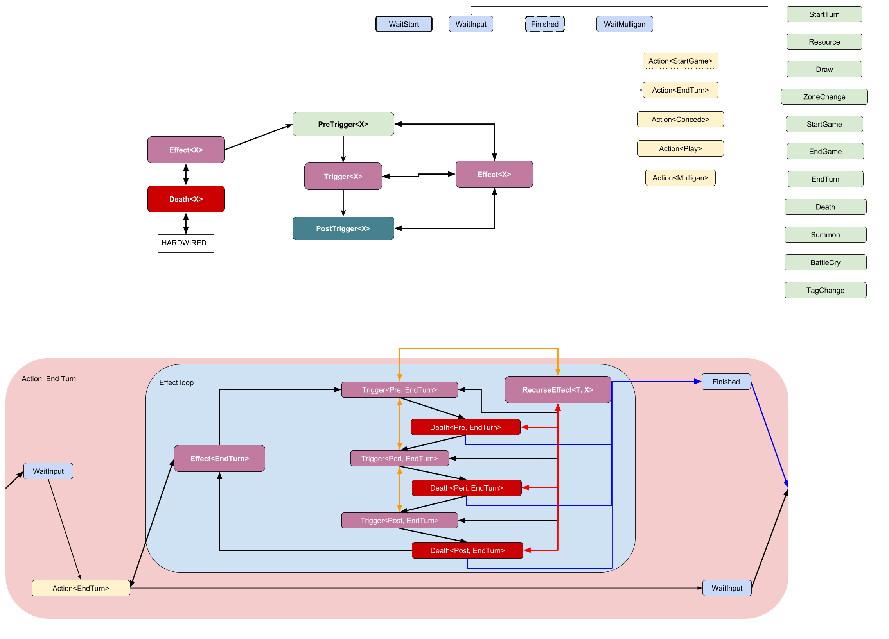

# Medici

Ever searched for a "Game engine", but the results didn't satisfy your needs?
Tried to update your search query with "Simulator engine" resulting in the same feeling?
So have I, and decided to build Medici.

Medici is an opiniated server simulation framework.
It DOES NOT come with tightly coupled event loops, user input event handling, GUI or audio systems.
It DOES help you easily build your own (board) game simulator in a robust and typesafe manner.
Medici and derivates are meant to be used as flexible building blocks. Other libraries could wrap
the game's state machine. It's more idiomatic to composite other libraries into the state machine itself.
The latter allows these libraries to be used without introducing the additional complexity of global
variables and their safe access patterns.

## REWRITE V2

An overhaul of Medici code is happening, this could end with parts being rewritten. The expectation is that the general layout
of state machines itself won't change.

## Principles

1 Maximum type safety;

- Any dynamic code can be hardcoded to their trigger condition.
- No guessing of current runtime state necessary,
- Leads to maximum robustness,

2 Catch programming errors at compile time;

- Transitions are fixed to chosen State types,
- The type system validates ALL state transitions at compile time,

3 Maximum implementation flexibilty;

- Implement behaviours as triggers*,
- Freedom to implement dynamic behaviour in a loosly coupled manner,

4 Maximum performance.

> *A trigger is a function which is registered with - and stored within the game's state machine.
> A trigger function is coupled to one 'triggerable' state and one 'timing' state. Both these states
> are the condition for executing the trigger function. See [the documentation](https://bert-proesmans.github.io/medici/medici_core/function/trait.TriggerState.html) for more information.

## How to use it?

> Medici is still being worked on. Mainly usability improvements are still under construction.
> It's concepts however are already clear.

> Look at [game_system](https://bert-proesmans.github.io/medici/game_system/index.html) and [game_rules](https://bert-proesmans.github.io/medici/game_rules/index.html) for an example implementation.

1. Use Medici concepts to build a state machine structure for your game. All relevant containers and services
should be stored within thate structure.

2. Next up is to define all states which your game could transition into.

3. With all states known you write transitions. Two transition concepts are supported; one-way
transitions and bi-directional transitions (Pushdown+Pullup).

> All of the above should be stored into one crate which you'd describe as container for your
> game system(s).

4. Next up, contained by another crate, is implementation of game triggers, player actions and game-cards.
These components are the embodiment of your game rules.

Now you have completely implemented your game system and -rules. Combine these 2 crates with other
crates from the Rust ecosystem to handle networked input, logging, time constraints etc.
Make the result fit your use case.

## Helping out

Any help offered is gladly accepted; specifically related to usability design, macro/concept implementation
and additional use cases.

* Usability design

	- A lot of code within game_system can be seen as boilerplate. Macros could be used
	to automatically generate all boilerplate. The main	blocker here is that most boilerplate code
	actually needs to know all the fields of the game structure.
	The blocker could be lifted using compiler extensions, probably, which I currently know nothing about.

* Use cases

	- The framework is currently being built in a way that favors board-/card game
	implementations. Coming up with more fundamentally different game designs prevents us from developing
	tunnel vision. Tunnel vision is a problem here because the framework will be too heavily optimized
	for the boardgame kind.
